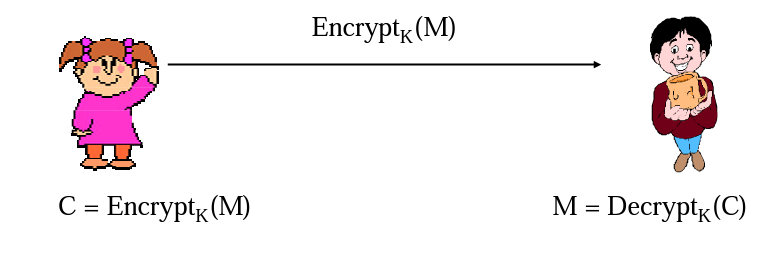

# Key Establishment

For the above communication,
- Alice and Bob need a shared secret $K$
- Problem to be solved:
  - How to establish the shared secret
  - How to refresh it (it is not a good idea to encrypt a lost of data with the same key)

## Key Transport vs. Key Agreement
Key establishment is the process to establish a shared secret key available to two or more parties:
- **key transport**: one party creates the secret, and securely transfers it to the other(s)
- **key agreement**: the shared secret is derived by two (or more) parties

## Key Pre-distribution vs. Dynamic Key Establishment

- **Key pre-distribution**: established keys are completely determined a priori by initial keying material
  - generally in the form of key agreement
- **Dynamic shared key establishment**: protocols that keys established between a fixed group of users varies in different sessions
  - also known as session key establishment
  - could be key transport or key agreement

## Long-Term Key vs. Session Key

- Session key: temporary key, used for a short time period. 
- Long-term key: used for a long term period, sometimes public and secret key pairs used to sign messages.
- Using session keys to: 
  - limit available cipher-text encrypted with the same key
  - limit exposure in the event of key compromise
  - avoid long-term storage of a large number of distinct secret keys
  - create independence across communications sessions or applications

## Basic Key Transport Protocol

Assumes a long term symmetric key K shared between A and B
###  Basic 
- Let $r_A$ a new key 
- $A \rightarrow B: E_K(r_A)$

### Prevents replay attacks:
An attacker 
- may reply the key to another party having the same long term key $K$
- may replay a older key to the same party

To mitigate these issues, the key shall be binded with a timestamp information and receipine of the key
- Let $r_A$ a new key 
- $A \rightarrow B: E_K(r_A, t_A, B)$

### Key transport with challenge/response (single authentication)
- $A \leftarrow B: n_B$
- Let $r_A$ a new key generated by A
- $A \rightarrow B: E_K(r_A, n_B, B)$

### Key transport with challenge/response (mutual authentication)
- $A \leftarrow B: n_B$
- Let $r_A$ a random number generated by A
- $A \rightarrow B: E_K(r_A, n_A, n_B, B)$
- Let $r_B$ a random number generated by B
- $A \leftarrow B: E_K(r_B, n_A, n_B, A)$

Notes:
- Provides mutual authentication and key authentication 
- Jointly control the key
- Does not provide perfect forward secrecy

## Authenticated Key Exchange Protocol 2 (AKEP2)

## Key Encapsulation Mechanism (KEM))

## Key Excahnage (KEX)

# Links
- https://www.cs.purdue.edu/homes/ninghui/courses/Fall05/lectures/355_Fall05_lect34.pdf
- 