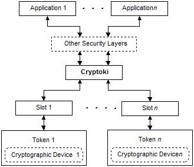
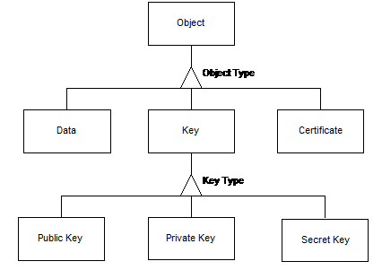
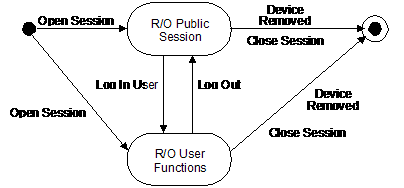
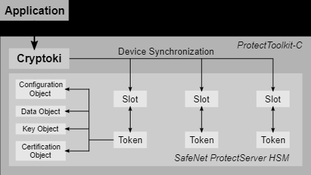
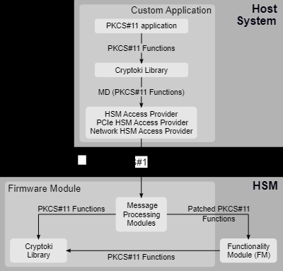
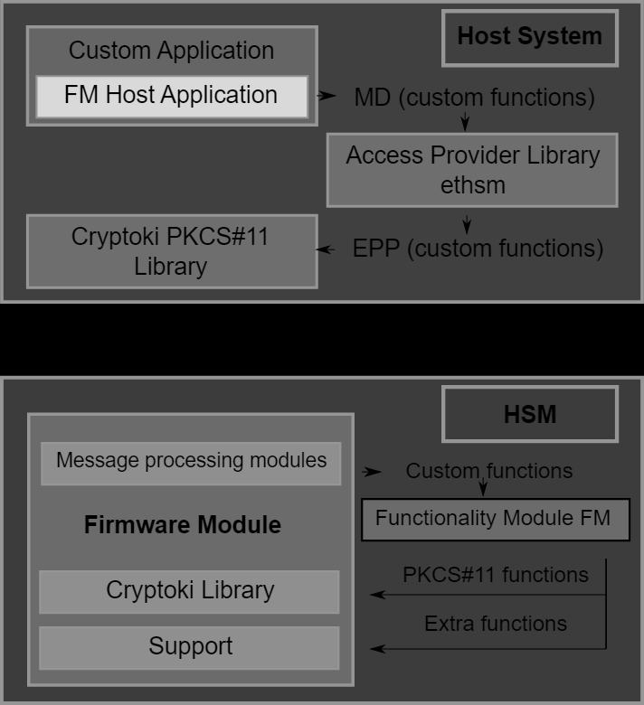

# pkcs11

**Logical view provided by the PKCS #11 API**

# Cryptoki

## General model

Cryptoki's general model is illustrated in the following figure. The model begins with one or more applications that need to perform certain cryptographic operations, and ends with a cryptographic device, on which some or all of the operations are actually performed. A user may be associated with an application.

**General Model**

Cryptoki provides an interface to one or more cryptographic devices that are active in the system through a number of "slots". Each slot, which corresponds to a physical reader or other device interface, may contain a token. A token is "present in the slot" (typically) when a cryptographic device is present in the reader. Of course, since Cryptoki provides a logical view of slots and tokens, there may be other physical interpretations. It is possible that multiple slots may share the same physical reader. The point is that a system has some number of slots and applications can connect to all those tokens.

## Logical view of a token

Cryptoki's logical view of a token is a device that stores objects and can perform cryptographic functions. Cryptoki defines three classes of object: Data, Certificates, and Keys. A data object is defined by an application. A certificate object stores a public-key certificate. A key object stores an encryption key. The encryption key be may a public key (RSA, DSA or Diffie-Hellman), a private key (RSA, DSA or Diffie-Hellman) or a secret key (RC2, RC4, DES, etc.). This view is illustrated in the following figure. The key types given are those supported for this version of Cryptoki; other key types may well be added in future versions.

**Object Hierarchy**

Objects are also classified according to their lifetime and visibility. "Token objects" are visible to all applications connected to the token, and remain in the token after the "session" or connection between an application and the token is closed. "Session objects" are visible only to the application that creates them, and are destroyed automatically when the session is closed.

Further classification defines access requirements. "Public objects" are visible to all applications that have a session with the token. "Private objects" are visible to an application only after a user has been authenticated to the token by a PIN.

A token can create and destroy objects, manipulate them, and search for them. It can also perform cryptographic functions on objects. It is possible for the token to perform the cryptographic operations in parallel with the application, assuming the underlying device has its own processor. In addition, a token may have an internal random number generator.

It is important to distinguish between the logical view of a token and the actual implementation, because not all cryptographic devices will have this concept of "objects," or be able to perform every kind of cryptographic function. Many devices will simply have fixed storage places for keys of a fixed algorithm, and be able to do a limited set of operations. Cryptoki's role is to translate this into the logical view, mapping attributes to fixed storage elements and so on. Not all Cryptoki libraries and tokens need to support every object type. It is expected that standard "profiles" will be developed, specifying sets of algorithms to be supported.

"Attributes" are characteristics that distinguish an instance of an object. In Cryptoki, there are general attributes, such as whether the object is private or public. There are also attributes particular to an object, such as a modulus or exponent for RSA keys.

## Users

This version of Cryptoki recognizes two token user types. One type is a Security Officer (SO). The other type is the normal user. Both types of user must be authenticated with a PIN to the token before any access to private objects is allowed. Some tokens may require that a user be authenticated before any cryptographic function can be performed on the token, whether or not it involves private objects. The role of the SO is to initialize a token and to set the normal user's PIN, and possibly manipulate some public objects. A normal user cannot log in until the SO has set the user's PIN.

Other than the support for two types of user, Cryptoki does not address the relationship between the SO and a community of users. In particular, the SO and the User may be the same person or may be different, but such matters are outside the scope of this standard.

With respect to PINs, Cryptoki assumes only that they are variable-length character strings from the set in Table 4 -3. Any translation to the device's requirements is left to the Cryptoki library. The following items are beyond the scope of Cryptoki:

Any padding of the PIN.
How the PINs are generated (by the user, by the application, or some other means). Future version of Cryptoki will address other means of authentication, such as biometrics and PIN entry via a PIN pad attached to the device or its reader.

## Sessions

Cryptoki requires that an application "open a session" with a token before the application has access to the token's objects and functions. **The session provides the logical connection between the application and the token**. A session can be a read/write (R/W) session or a read-only (R/O) session. Read/write and read-only refer to the access to token objects, not to session objects. In both session types, an application can create, read, write and destroy session objects, and read token objects. However, only in a read/write session can an application create, write and destroy token objects.

**After a session is opened, the application has access to the token's "public" objects.** To gain access to the token's **"private" objects, a user must log in and be authenticated**.

**Cryptoki supports multiple sessions on multiple tokens.** An application may have one or more sessions with one or more tokens. A token may have multiple sessions with one or more applications. **Some tokens may allow only one read/write session at any given time.**

An open session can be in one of several states. The session state determines allowable access to objects and functions that can be performed on them. The session states are described in the next two sections.

### Read-only session states

A read-only session can be in one of two states, as illustrated in the following figure. When the session is opened, it is in the "R/O Public Session" state. Only the normal user may open a read-only session.

**Read Only Session States**

### Read/write session states

A read/write session can be in one of three states, as illustrated in the following figure. When the session is opened, it is in the "R/W Public Session" state.

(rd_rw_session_states.png)
**Read/Write Session States**

## Links
- 	[Cryptographic Token Interface Standard](https://www.cryptsoft.com/pkcs11doc/v100/group__SEC__7__GENERAL__OVERVIEW.html)

# Thales Luna HSM

