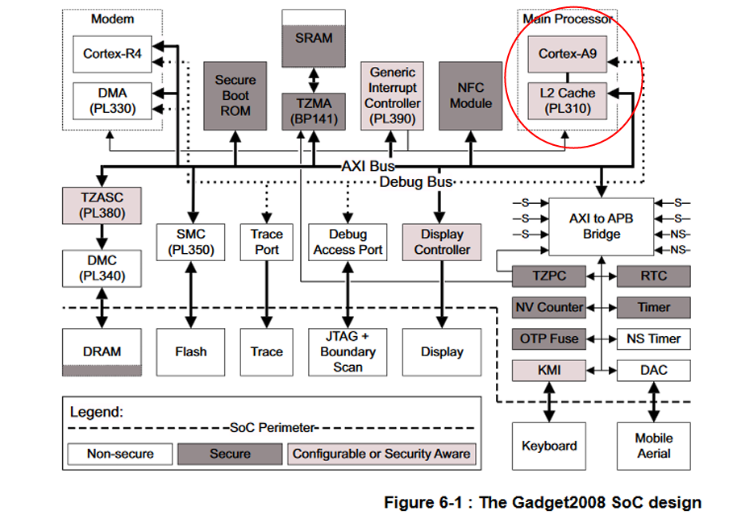

# ARM TrustZone

## System/Hardware architecture

**ARM TrustZOne System architecture.**

**Architecture on a TrustZone-assisted System-On-Chip (SoC)**

## Context switching (Trasition between secure and non-secure worlds)

As mentioned previously, the primary role of the monitor is to context switch resources that are needed in both worlds. Any secure state saved by the monitor should be saved into a region of Secure memory, so that the Normal world cannot tamper with it.

Exactly what needs to be saved and restored for each switch depends on the hardware design, and the software model used for inter-world communications. The list typically includes:

All general purpose ARM registers.
Any coprocessor registers, such as NEON or VFP. Note: Only required if coprocessor is used in both worlds.
Any world-dependant processor configuration state in CP15.

Links:
- Context switching

## Links
- https://microchipdeveloper.com/32arm:saml11-trustzone-implementation
- [MiniTEE—A Lightweight TrustZone-Assisted TEE for Real-Time Systems](https://www.mdpi.com/2079-9292/9/7/1130/htm)
- [Secure Initialization of TEEs - when secure boot falls short…](https://www.riscure.com/uploads/2017/08/euskalhack_2017_-_secure_initialization_of_tees_when_secure_boot_falls_short.pdf)
- [How the Secure model works](https://developer.arm.com/documentation/ddi0333/h/programmer-s-model/secure-world-and-non-secure-world-operation-with-trustzone/how-the-secure-model-works)

# Others

