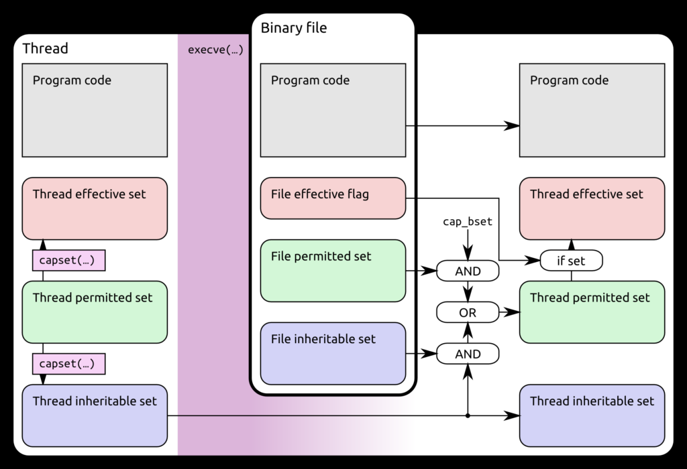
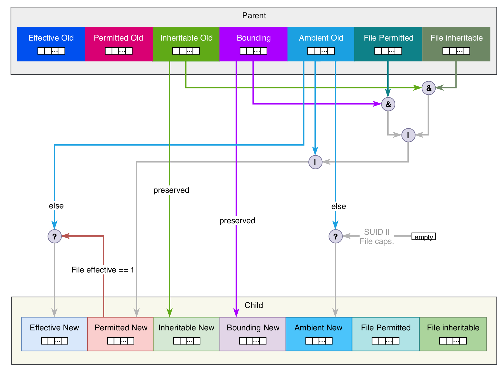

## Traditional Model

Before Linux kernel 2.2, the Linux privilege model typically made a binary decision as a first instance to decide if a process has the required privileges to run a program.

If the Effective User ID (EUID) of the process was 0. This means the effective user is root or a superuser. This user bypassed all other forms of checks and the process ris allowed to run the application. If the EUID is not 0, the process is subjected to other checks such as an examination of the

- privileges held by the EUID of the process.
- privileges held by the Effective Group ID (EGID)
- privileges held by the supplementary groups the user intending to run the process belongs to.

## least privilege principle

Enabling a process to be granted just the required privilege it requires to perform its tasks and no more.

## Linux Capability

Capabilities are a fine-grained approach to privileges and access control permissions. This is at variance to the all-or-nothing approach of the traditional model where a process needs to run as a super user of some form in other to perform its function. The privileged activities on a system are divided into distinct units with each capability holding a subset of activities.

[source](https://blog.ploetzli.ch/2014/understanding-linux-capabilities/)

### CAPABILITY RULES

Child processes created using fork inherit the full set of the parent’s capabilities. Moreover, there exist rules [1] to determine whether and how capabilities of a process are being inherited or modified upon calling execve when creating a child process:

## Linux

- Gerlof Langeveld - [Practical use of Linux capabilities (Full Talk)](https://www.youtube.com/watch?v=WYC6DHzWzFQ&ab_channel=TheCentOSProject) , at the ORNL CentOS Dojo
- [Linux Capabilities in a nutshell](https://k3a.me/linux-capabilities-in-a-nutshell/)
- [LINUX CONTAINER BASICS: CAPABILITIES](https://www.schutzwerk.com/en/43/posts/linux_container_capabilities/)
- [What's The Big Deal With Linux Capabilities?](https://hackernoon.com/whats-the-big-deal-with-linux-capabilities)