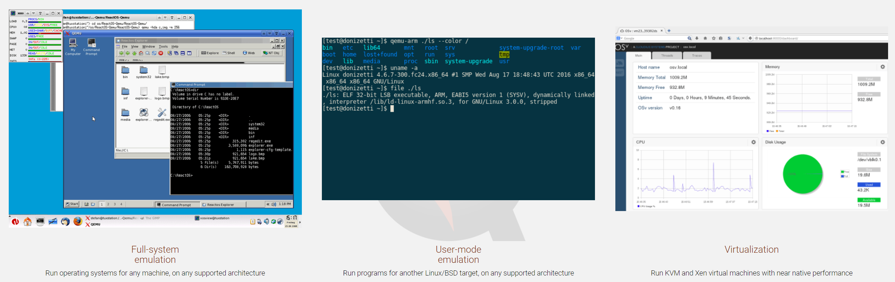
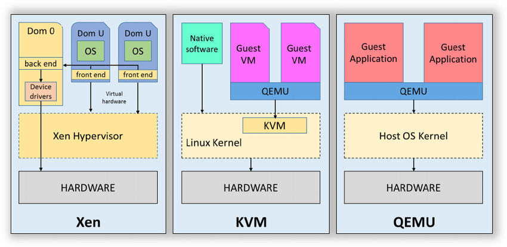

# QEMU (Quick Emulator)

QEMU is a generic and open source **machine emulator** and **virtualizer**.

QEMU can be used in several different ways. 

- The most common is for “system emulation”, where it provides a virtual model of an entire machine (CPU, memory and emulated devices) to run a guest OS. In this mode the CPU may be fully emulated, or it may work with a hypervisor such as KVM, Xen, Hax or Hypervisor.Framework to allow the guest to run directly on the host CPU.

- The second supported way to use QEMU is “user mode emulation”, where QEMU can launch processes compiled for one CPU on another CPU. In this mode the CPU is always emulated.

QEMU also provides a number of standalone command line utilities, such as the `qemu-img` disk image utility that allows you to create, convert and modify disk images.

## Terminologies

### Host and Targets

The host is the platform and architecture where QEMU is running on. Usually an x86 machine.

The target is the architecture which is emulated by QEMU. You can choose at build time which one you want:

```bash
./configure --target-list=ppc-softmmu ...
```

As such, in the source code organisation you will find all supported architectures in the target/ directory:

```
(qemu-git) ll target
drwxrwxr-x 2 xxx xxx 4.0K alpha
drwxrwxr-x 2 xxx xxx 4.0K arm
drwxrwxr-x 2 xxx xxx 4.0K cris
drwxrwxr-x 2 xxx xxx 4.0K hppa
drwxrwxr-x 3 xxx xxx 4.0K i386
drwxrwxr-x 2 xxx xxx 4.0K lm32
drwxrwxr-x 2 xxx xxx 4.0K m68k
drwxrwxr-x 2 xxx xxx 4.0K microblaze
drwxrwxr-x 2 xxx xxx 4.0K mips
drwxrwxr-x 2 xxx xxx 4.0K moxie
drwxrwxr-x 2 xxx xxx 4.0K nios2
drwxrwxr-x 2 xxx xxx 4.0K openrisc
drwxrwxr-x 3 xxx xxx 4.0K ppc
drwxr-xr-x 3 xxx xxx 4.0K riscv
drwxrwxr-x 2 xxx xxx 4.0K s390x
drwxrwxr-x 2 xxx xxx 4.0K sh4
drwxrwxr-x 2 xxx xxx 4.0K sparc
drwxrwxr-x 2 xxx xxx 4.0K tilegx
drwxrwxr-x 2 xxx xxx 4.0K tricore
drwxrwxr-x 2 xxx xxx 4.0K unicore32
drwxrwxr-x 9 xxx xxx 4.0K xtensa
```

The `qemu-system-<target>` binaries are built into their respective `<target>-softmmu` directory:

```bash
(qemu-git) ls -ld *-softmmu
drwxr-xr-x  9 xxx xxx 4096 i386-softmmu
drwxrwxr-x 11 xxx xxx 4096 ppc-softmmu
drwxr-xr-x  9 xxx xxx 4096 x86_64-softmmu
```


### System and user modes

QEMU is a system emulator. It offers emulation of a lot of architectures and can be run on a lot of architectures.

It is able to emulate a full system (cpu, devices, kernel and apps) through the `qemu-system-<target>` command line tool. This is the mode we will dive into.

It also provides a userland emulation mode through the `qemu-<target>` command line tool.

This allows to directly run <target> architecture Linux binaries on a Linux host. It mainly emulates <target> instructions set and forward system calls to the host Linux kernel. The emulation is only related to user level cpu instructions, not system ones, no device nore low level memory handling.

### Emulation, JIT and virtualization

Initially QEMU was an emulation engine, with a Just-In-Time compiler (TCG). The TCG is here to dynamically translate target instruction set architecture (ISA) to host ISA.

We will later see that in the context of the TCG, the tcg-target becomes the architecture to which the TCG has to generate final assembly code to run on (which is host ISA). Obvious !

*There exists scenario where target and host architectures are the same. This is typically the case in classical virtualization environment* (VMware, VirtualBox, …) when a user wants to run Windows on Linux for instance. The terminology is usually Host and Guest (target).

Nowadays, QEMU offers virtualization through different accelerators. **Virtualization is considered an accelerator because it prevents unneeded emulation of instructions when host and target share the same architecture.** Only system level (aka supervisor/ring0) instructions might be emulated/intercepted.

Of course, the **QEMU virtualization capabilities are tied to the host OS and architecture. The x86 architecture offers hardware virtualization extensions (Intel VMX/AMD SVM)**. But the host operating system must allow QEMU to take benefit of them.

Under an x86-64 Linux host, we found the following accelerators:

```bash
$ qemu-system-x86_64 -accel ?
Possible accelerators: kvm, xen, hax, tcg
```

While on an x86-64 MacOS host:

```bash
$ qemu-system-x86_64 -accel ?
Possible accelerators: tcg, hax, hvf
```

The supported accelerators can be found in `qemu_init_vcpu()`:

```c
void qemu_init_vcpu(CPUState *cpu)
{
...
    if (kvm_enabled()) {
        qemu_kvm_start_vcpu(cpu);
    } else if (hax_enabled()) {
        qemu_hax_start_vcpu(cpu);
    } else if (hvf_enabled()) {
        qemu_hvf_start_vcpu(cpu);
    } else if (tcg_enabled()) {
        qemu_tcg_init_vcpu(cpu);
    } else if (whpx_enabled()) {
        qemu_whpx_start_vcpu(cpu);
    } else {
        qemu_dummy_start_vcpu(cpu);
    }
...
}
```

To brief:
- kvm is the Linux Kernel-based Virtual Machine accelerator;

- hvf is the MacOS Hypervisor framework accelerator;

- hax is the cross-platform Intel HAXM accelerator;

- whp is the Windows Hypervisor Platform accelerator.

You can take benefit of the speed of x86 hardware virtualization under the three major operating systems. Notice that the TCG is also considered an accelerator. We can enter a long debate about terminology here …

## Architectures





Comparison of Xen, KVM, and QEMU. [[source](https://www.researchgate.net/figure/Comparison-of-Xen-KVM-and-QEMU_fig1_281177318)]


[[source](https://imgs.developpaper.com/imgs/27422-20210325145629364-484990523.png)]


[[source](https://imgs.developpaper.com/imgs/27422-20210325145421925-1709528302.png)]


QEMU/KVM virtual machines [[source](https://developers.redhat.com/blog/wp-content/uploads/2015/02/virt-stack.png?w=300)]


[[source](https://imgs.developpaper.com/imgs/27422-20210325160843224-598408286.png)]


[[source](https://imgs.developpaper.com/imgs/27422-20210325161028056-811288144.png)]


Debugging using gdbserver inside QEMU. [[source](https://balau82.wordpress.com/2010/08/17/debugging-arm-programs-inside-qemu/)]


[[source](https://www.techtarget.com/searchitoperations/tip/QEMU-50-continues-a-legacy-of-emulation)]

QEMU started out as a novel way to run alternative OSes from within a Linux environment and evolved into a full-featured virtualization tool. QEMU 5.0 runs on Linux, macOS and Windows. On Linux, admins can either run full-system emulation mode or user-mode emulation. It's also possible to run either KVM or Xen VMs, with performance approaching that of the native hardware.

Both KVM and Xen function as hypervisors, meaning they serve as a layer between the hardware and the virtual images running in their own memory space. KVM -- a Type 2 hypervisor -- runs on top of the underlying Linux OS, whereas Xen -- a Type 1 hypervisor -- runs directly on the hardware without an underlying OS.

QEMU is an application that runs just like any other application on the host OS. QEMU functions as a Type 2 hypervisor because it runs on top of a host OS. Because of this, admins might notice that QEMU and KVM are similar; KVM can perform hardware acceleration. The big difference is that QEMU can emulate different CPU architectures in software.

Kata Containers is an example of QEMU in action. Kata Containers aims to take the best of containers and VMs and merge them together. Security stands out as a primary focus of Kata Containers, demonstrated by providing stronger workload isolation using hardware virtualization technology as a second layer of defense.


## Links
- [QEMU internals](https://airbus-seclab.github.io/qemu_blog/) [ a good article to start ]
- [Live Migrating QEMU-KVM Virtual Machines](https://developers.redhat.com/blog/2015/03/24/live-migrating-qemu-kvm-virtual-machines)
- https://wiki.qemu.org/Documentation/Networking
- [Debugging ARM programs inside QEMU](https://balau82.wordpress.com/2010/08/17/debugging-arm-programs-inside-qemu/)
- [ARM Emulation on x86 Amazon Linux 2/1/Centos — Ubuntu/Debian](https://medium.com/@earielli/arm-emulation-on-x86-amazon-linux-2-1-centos-ubuntu-debian-a5a3cc4fba76)
- [KVM QEMU analysis of Linux Virtualization (2) armv8 virtualization](https://developpaper.com/original-kvm-qemu-analysis-of-linux-virtualization-2-armv8-virtualization/) [Explain TrustZone using QEMU]
- Getting Started with QEMU and KCM [Chapter 1, [book](https://www.google.co.in/books/edition/KVM_Virtualization_Cookbook/2Hc5DwAAQBAJ?hl=en&gbpv=1&dq=qemu+emulation+modes&pg=PA7&printsec=frontcover)]
- [QEMU 5.0 continues a legacy of emulation](https://www.techtarget.com/searchitoperations/tip/QEMU-50-continues-a-legacy-of-emulation)
- https://wiki.debian.org/QEMU
- https://wiki.archlinux.org/title/QEMU