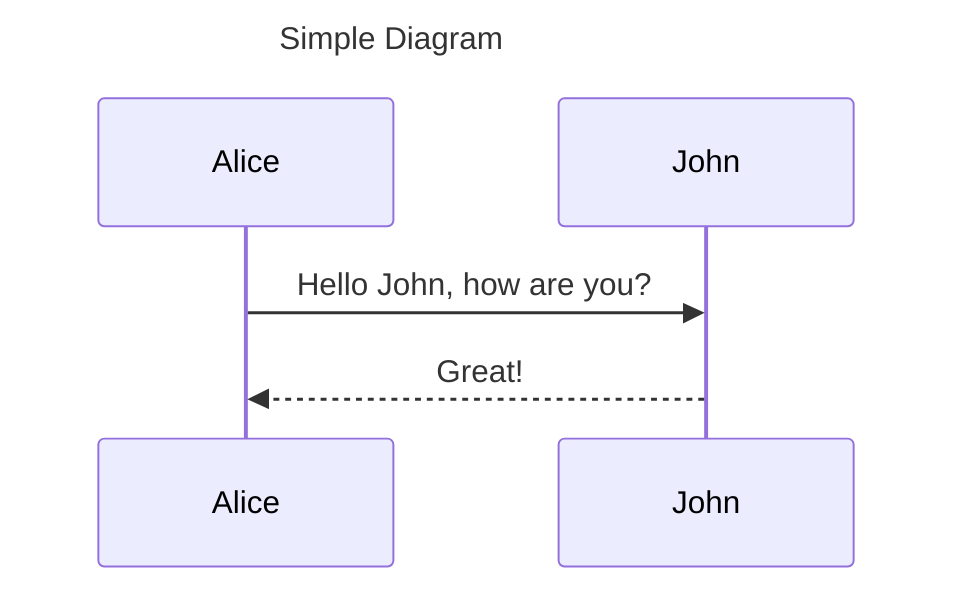
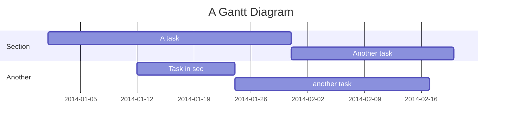

# Newline
Following approach is tested in Github. Following approach can be followed to get a newline:
- Put `\ ` at the end of a line without any text after `\` 
- Put `\,` if there is text after `\`
- Or use classic `<br>`


## Inline Links	
	
```
A [link](http://example.com "Title").
```

A [link](http://example.com "Title").

## Referenced Links

```
Some text with [a link][1] and
another [link][2].

[1]: http://example.com/ "Title"
[2]: http://example.org/ "Title"
```

Some text with [a link][1] and
another [link][2].

[1]: http://example.com/ "Title"
[2]: http://example.org/ "Title"


## Footnotes
```
I have more [^1] to say up here.

[^1]: To say down here.
```

## Image 
```plaintext

**Image Caption**
```
Note: image_path can be a local path or url.

## Blockquotes

```
> Quoted text.
> > Quoted quote.

> * Quoted 
> * List
```	

> Quoted text.
> > Quoted quote.

> * Quoted 
> * List

## Code block
```
~~~~
This is a 
piece of code 
in a block
~~~~

Alternative is, use a block sorrounded with three back quotes at the top and the bottom.
```

~~~~
This is a 
piece of code 
in a block
~~~~

## How to draw diagrams?
As a developer, we prefere to like the phylosophy x-as-code. There should not be an exception for pictures like sequence diagrams, flow charts, etc. You should check [this](https://gist.github.com/blackcater/1701e845a963216541591106c1bb9d3b) to learn various ways to draw a diagram in markdown. Note that all these approaches might not work in github/gitlab, but it should work locally. We use mermaid which is supported in both github and gitlab.

### Mermaid
Markdown (Githum and Gitlab flavours) supports [mermaid](https://github.com/mermaid-js/mermaid/blob/develop/docs/sequenceDiagram.md) based drawing.

Sequence diagram:



Gantt chart:

<div class="x-scrollable">
<div style="width: 1800px;">


</div>
</div>

For more details, you should check the following links:
- [About Mermaid](https://mermaid-js.github.io/mermaid/#/)
- [Mermaid Cheat Sheet](https://jojozhuang.github.io/tutorial/mermaid-cheat-sheet/)
- [Draw Diagrams With Markdown](https://support.typora.io/Draw-Diagrams-With-Markdown/)
- [Markdown Monster Documentation](https://markdownmonster.west-wind.com/docs/_5ef0x96or.htm)
- [Mermaid Live Editor](https://mermaid-js.github.io/mermaid-live-editor/edit#pako:eNpVkE1qw0AMha8itEohvoAXhcZOsgmk0Ow8WQiPnBmS-WEsU4Ltu3ccU2i1kt77nhAasQ2ascRbomjgUisPuT6ayiTbi6P-CkXxPh1ZwAXPzwl2m2OA3oQYrb-9rfxugaAaTwvGIMb6-7xa1St_9jxB3ZwoSojXv87lO0ywb-ynyev_OyZxTh2ajsqOipYSVJReCG7RcXJkdT59XBSFYtixwjK3mjsaHqJQ-TmjQ9QkvNdWQsJS0sBbpEHC19O3v_PK1JbyI9wqzj8k-lxH)
- [GitLab Flavored Markdown](https://docs.gitlab.com/ee/user/markdown.html)
- [Gitlab Mermaid Layouts](https://about.gitlab.com/handbook/tools-and-tips/mermaid/)
## Syntax highlighting

# Comment


# Slides in Markdown
You can create slide in Markdown using [GitPitch](https://gitpitch.com/)

# Important links
- https://www.markdownguide.org/extended-syntax/
- https://github.com/adam-p/markdown-here/wiki/Markdown-Cheatsheet
- https://wordpress.com/support/markdown-quick-reference/
