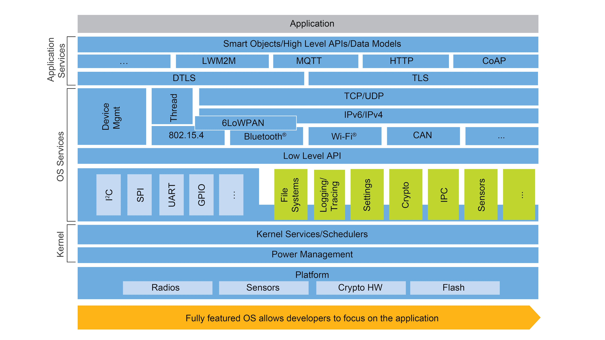

# Zephyr


<p style="text-align:center; font-weight: bold">Zephyr context view</p>


<p style="text-align:center; font-weight: bold">Zephyr driver frameworks and HAL</p>


<p style="text-align:center; font-weight: bold">Zephyr layers and dependencies</p>


<p style="text-align:center; font-weight: bold">Zephyr OS</p>

<!-- <picture> 

</picture> -->

One should start reading [tutorial][nordicsemi_zephyr_app_dev] from nordicsemi.com to understand the overall staructure of zephyr code and application code structure, build, run and debug process.

## Quick notes
- Zephyr build generates a single .elf file which is having application binary and zephyr binary together.
- Build command shall be called from application root directory.

## Application development. Standard boards 

[source][softserveinc_note]

Zephyr’s base directory hosts Zephyr’s own source code, its kernel configuration options, and its build definitions. It can reside anywhere, but the location is controlled by west update command, where [target directory] for Zephyr’s own code is specified. For the application to know this location—as well as other setting parameters—you need to run the zephyr-env.sh script residing in root Zephyr’s directory prior to application building.

At minimum, Zephyr’s application folder (app) needs to contain the following items (files):

```
CmakeLists.txt
prj.conf
Kconfig
src/*.c
```
As a result, the binary image is being built and placed in an automatically created build/zephyr folder.

## Build control

The Zephyr build system is very flexible and uses many variables.

The most used are ZEPHYR_BASE, BOARD, and DTC_OVERLAY_FILE which can be supplied to the build system in different ways: either as parameters to west command, as an environmental variable, or as a proper statement in the CMakeLists.txt file.

Zephyr uses CMake’s concept of a ‘target’ to organize the build. A target can be an executable, a library, or a generated file. For application developers, the library target is the most important to understand. All source code that goes into a Zephyr build does so by being included in a library target, even application code.

Library targets have source code, that is added through CMakeLists.txt build scripts like this:

```
target_sources(app PRIVATE src/main.c)
```

In the above CMakeLists.txt, an existing library target named app is configured to include the source file src/main.c. The PRIVATE keyword indicates that we are modifying the internals of how the library is being built. Using the keyword PUBLIC would modify how other libraries that link with app are built. In this case, using PUBLIC would cause libraries that link with app to also include the source file src/main.c, behavior that we surely do not want. The PUBLIC keyword could however be useful when modifying the include paths of a target library.

## Other resources
- [zephyr](https://github.com/zephyrproject-rtos/zephyr)
- [zephyr build setup](https://docs.zephyrproject.org/latest/develop/getting_started/index.html)
- [Build System (CMake)](https://docs.zephyrproject.org/latest/build/cmake/index.html)
- [Zephyr Example Application](https://github.com/zephyrproject-rtos/example-application)
- [zephyr application development](https://docs.zephyrproject.org/latest/develop/application/index.html#build-an-application)
- [Circuit Dojo Youtube Channel](https://www.youtube.com/c/CircuitDojo)
- [air-quality-wing-zephyr-demo](https://github.com/circuitdojo/air-quality-wing-zephyr-demo/tree/main/basic)
- [How to Build Drivers for Zephyr](https://interrupt.memfault.com/blog/building-drivers-on-zephyr)
- [How to build your Zephyr app in a standalone folder](https://blog.golioth.io/how-to-build-your-zephyr-app-in-a-standalone-folder/) 
- [Hands-On Workshop: Build Your First Zephyr Application on i.MX RT](https://www.nxp.com/docs/en/training-reference-material/BUILD-YOUR-FIRST-ZEPHYR-APPLICATION-ON-I.MX-RT.pdf)

<!-- References -->
[nordicsemi_zephyr_app_dev]: https://developer.nordicsemi.com/nRF_Connect_SDK/doc/2.0.0/zephyr/develop/application/index.html
[softserveinc_note]: https://www.softserveinc.com/de-de/blog/zephyr-rtos-application-development